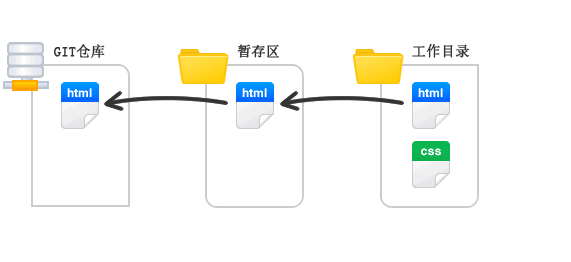
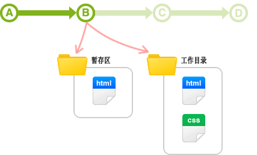
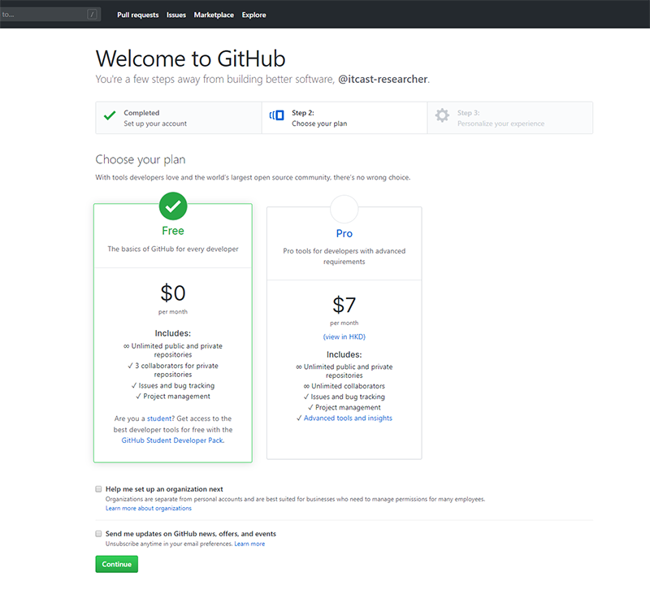
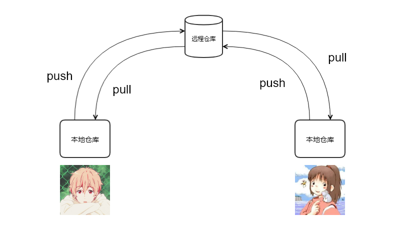
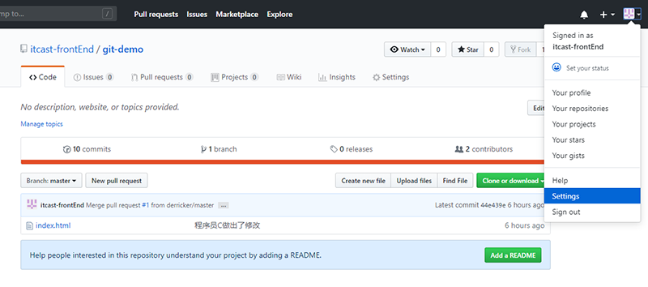

## Git 
### Working Directory 工作区
- 工作区就是我们指定的仓库文件夹

### 版本库（Repository）
工作区有一个隐藏目录.git，这个不算工作区，而是Git的版本库。

Git的版本库里存了很多东西，其中最重要的就是称为stage（或者叫index）的暂存区，还有Git为我们自动创建的第一个分支master，以及指向master的一个指针叫HEAD。   

1. ```git add``` 将文件加入到版本库（缓存区），```git commit```将文件提交到当前分支
2. 使用```git add```命令后，会在缓存区中创建对应文件副本。也就是说，接下继续修改文件后，再commit,新修改的内容并未提交到当前分支。

### 使用GitHub 作为远程仓库
Git 是一个分布式版本控制管理器,每个机器都有完整的版本库,每个机器都可以充当服务器的角色,供他人访问。    
在实际开发中, 都会指定一台机器最为远程仓库充当服务器, 进行协调开发。

#### 使用GitHub作为远程仓库(有GitHub账户)
1. SSH Key
查看主目录下有没有.ssh , .ssh 下有没有id_rsa 和 id_rsa.pub。如果有执行 2。如果没有则：  
```ssh-keygen -t rsa -C "youremail@example.com"```
2. 登陆GitHub 创建将 id_rsa.pub 中的信息, 粘贴到```Settings>SSH and GPG keys> add SSH key>key ```中。
    - 为什么GitHub需要SSH Key呢？因为GitHub需要识别出你推送的提交确实是你推送的，而不是别人冒充的，而Git支持SSH协议，所以，GitHub只要知道了你的公钥，就可以确认只有你自己才能推送。
    - 当然，GitHub允许你添加多个Key。假定你有若干电脑，你一会儿在公司提交，一会儿在家里提交，只要把每台电脑的Key都添加到GitHub，就可以在每台电脑上往GitHub推送了。
    - 最后友情提示，在GitHub上免费托管的Git仓库，任何人都可以看到喔（但只有你自己才能改）。所以，不要把敏感信息放进去。
3. 创建GitHub 仓库
4. 本地与远程同步
    1.方法一： 创建好了仓库会得到仓库链接。```git clone "https://github.com/3566562908/learngit.git"``` 克隆到本地,本地修改提交后使用 git push 同步。
    2. 方法二：本地创建对应的仓库，关联远程仓库```git remote add origin https://github.com/3566562908/learngit.git```,首次同步：```git push -u origin master```,本地修改保存后使用 , ```git push```   
    注： 使用第二种方法，在首次同步时可能因为本地master 和远程master 信息不一致导致失败，可以先使用```git pull origin master ```拷贝一下。
    
### 关于仓库地址
Git支持多种协议，包括https，但通过ssh支持的原生git协议速度最快。
=======
## 1. Git基础

### 1.1 版本管理

#### 1.1.1 什么是版本管理

版本管理是一种记录文件变化的方式，以便将来查阅特定版本的文件内容。


#### 1.1.2 人为维护文档版本的问题

1. 文档数量多且命名不清晰导致文档版本混乱

2. 每次编辑文档需要复制，不方便

3. 多人同时编辑同一个文档，容易产生覆盖


### 1.2 Git 是什么

Git是一个版本管理控制系统（缩写VCS），它可以在任何时间点，将文档的状态作为更新记录保存起来，也可以在任何时间点，将更新记录恢复回来。


### 1.3 Git 安装

[下载地址](https://git-scm.com/downloads) 

在安装的过程中，所有选项使用默认值即可。


### 1.4 Git 基本工作流程

| git仓库          | 暂存区             | 工作目录            |
| ---------------- | ------------------ | ------------------- |
| 用于存放提交记录 | 临时存放被修改文件 | 被Git管理的项目目录 |



### 1.5 Git 的使用

#### 1.5.1 Git 使用前配置

在使用 git 前，需要告诉 git 你是谁，在向 git 仓库中提交时需要用到。

1. 配置提交人姓名：`git config --global user.name 提交人姓名`
2. 配置提交人姓名：`git config --global user.email 提交人邮箱` 
3. 查看git配置信息：`git config --list`   

**注意**

1. 如果要对配置信息进行修改，重复上述命令即可。

2. 配置只需要执行一次。

#### 1.5.2 提交步骤

1. `git init` 初始化git仓库
2. `git status` 查看文件状态
3. `git add 文件列表` 追踪文件
4. `git commit -m 提交信息`  向仓库中提交代码
5. `git log` 查看提交记录

#### 1.5.3 撤销

- 用暂存区中的文件覆盖工作目录中的文件： `git checkout 文件`

- 将文件从暂存区中删除： `git rm --cached 文件`
- 将 git 仓库中指定的更新记录恢复出来，并且覆盖暂存区和工作目录：`git rest --hard commitID` 




## 2. Git进阶

### 2.1 分支

为了便于理解，大家暂时可以认为分支就是当前工作目录中代码的一份副本。

使用分支，可以让我们从开发主线上分离出来，以免影响开发主线。


#### 2.1.1 分支细分

1. 主分支（master）：第一次向 git 仓库中提交更新记录时自动产生的一个分支。

   

   

   

2. 、开发分支（develop）：作为开发的分支，基于 master 分支创建。

   

   

3. 功能分支（feature）：作为开发具体功能的分支，基于开发分支创建

   

   

**功能分支 -> 开发分支 -> 主分支**

#### 2.1.2 分支命令

- `git branch` 查看分支

- `git branch 分支名称` 创建分支

- `git checkout 分支名称` 切换分支

- `git merge 来源分支` 合并分支

- `git branch -d 分支名称` 删除分支（分支被合并后才允许删除）（-D 强制删除）


### 2.2 暂时保存更改

在git中，可以暂时提取分支上所有的改动并存储，让开发人员得到一个干净的工作副本，临时转向其他工作。

使用场景：分支临时切换

- 存储临时改动：`git stash`
- 恢复改动：`git stash pop`

## 3. Github

在版本控制系统中，大约90%的操作都是在本地仓库中进行的：暂存，提交，查看状态或者历史记录等等。除此之外，如果仅仅只有你一个人在这个项目里工作，你永远没有机会需要设置一个远程仓库。

只有当你需要和你的开发团队共享数据时，设置一个远程仓库才有意义。你可以把它想象成一个 “文件管理服务器”，利用这个服务器可以与开发团队的其他成员进行数据交换。

### 3.1 注册

1. 访问[github](https://github.com/)首页，点击 Sign up 连接。（注册）

   

2. 填写用户名、邮箱地址、GitHub登陆密码

   

3. 选择计划

   

4. 填写 GitHub 问题

   

5. 验证邮箱

   

6. GitHub 个人中心

   


### 3.2 多人协作开发流程

- A在自己的计算机中创建本地仓库
- A在github中创建远程仓库
- A将本地仓库推送到远程仓库
- B克隆远程仓库到本地进行开发
- B将本地仓库中开发的内容推送到远程仓库
- A将远程仓库中的最新内容拉去到本地




### 3.3 创建仓库

1. 填写仓库基本信息

   

2. 将本地仓库推送到远程仓库

   

   1. git push 远程仓库地址 分支名称

   2. git push 远程仓库地址别名 分支名称

   3. git push -u 远程仓库地址别名 分支名称

       -u 记住推送地址及分支，下次推送只需要输入git push即可

   4. git remote add 远程仓库地址别名 远程仓库地址

### 3.4 拉取操作

#### 3.4.1 克隆仓库

克隆远端数据仓库到本地：`git clone 仓库地址`

#### 3.4.2 拉取远程仓库中最新的版本

拉取远程仓库中最新的版本：`git pull 远程仓库地址 分支名称`

### 3.5 解决冲突

在多人同时开发一个项目时，如果两个人修改了同一个文件的同一个地方，就会发生冲突。冲突需要人为解决。

### 3.6 跨团队协作

1. 程序员 C fork仓库
2. 程序员 C 将仓库克隆在本地进行修改
3. 程序员 C 将仓库推送到远程
4. 程序员 C 发起pull reqest
5. 原仓库作者审核
6. 原仓库作者合并代码

### 3.7 ssh免登陆

https协议仓库地址：https://github.com/itcast-frontEnd/git-demo.git


生成秘钥：`ssh-keygen`

秘钥存储目录：C:\Users\用户\\.ssh

公钥名称：id_rsa.pub

私钥名称：id_rsa




### 3.8 GIT忽略清单

将不需要被git管理的文件名字添加到此文件中，在执行git命令的时候，git就会忽略这些文件。

git忽略清单文件名称：**.gitignore**

将工作目录中的文件全部添加到暂存区：`git add .`


